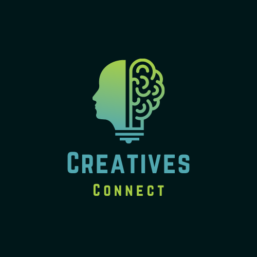

# CreativesConnect[Licence: MIT](https://github.com/Beldine-Moturi/CreativesConnect/blob/master/LICENSE)
# 
# CreativesConnect
<table>
<tr>
<td>
  A webapp using various APIs to display projects available for creatives to work on. It serves as a one-stop shop for Africa’s Creative minds to showcase their skills and portfolios, collaborate with each other and find jobs/projects and information about the creative industry.
</td>
</tr>
</table>

## Demo

## Features

## Usage

## Technologies used

## Authors